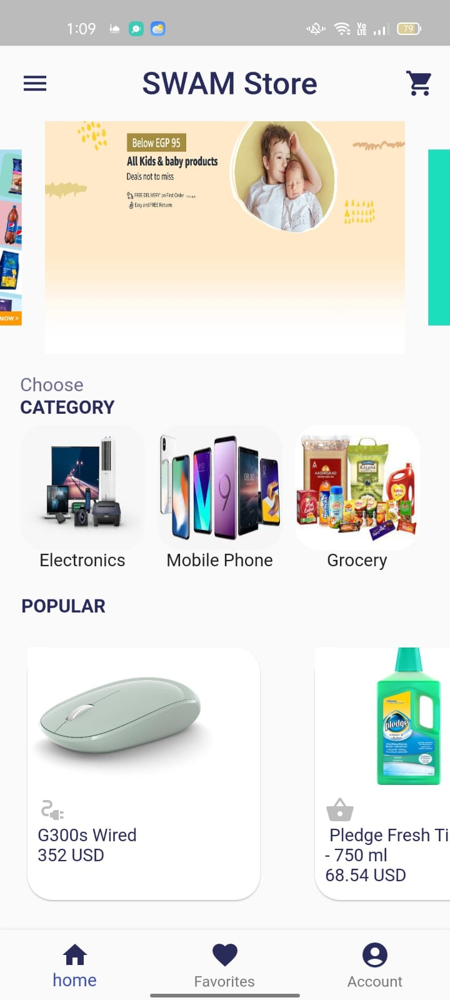
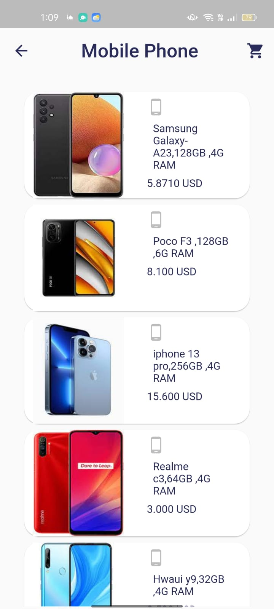
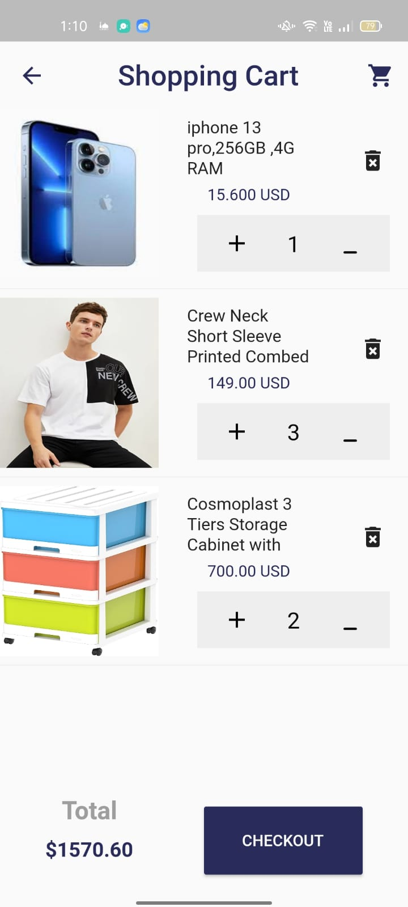
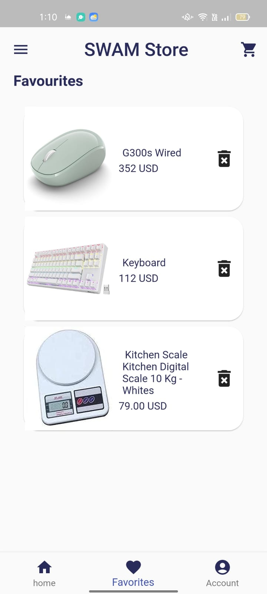

<div align="center">
  <h1> 🛒 Online Store App </h1>
  <p><b>A functional e-commerce mobile application developed during the ITI Flutter Development Course.</b></p>

  <a href="https://github.com/ahmed-mohamed74"><strong>View Repository »</strong></a>
</div>

<br />

## 📱 Project Overview
This project is an Online Store application built to practice core mobile development concepts. It features a modern shopping UI, state management for interactive elements, and a smooth user experience. It was completed as a final task for the **Information Technology Institute (ITI)** Flutter track.

### 🖼️ Screenshots
<div align="center">
  
  
  
  
</div>

---

## 🚀 Built With
This project utilizes the Flutter ecosystem to deliver a high-performance mobile experience:

* **Flutter & Dart** - Cross-platform framework.
* **Bloc** - Clean state management.
* **Carousel Slider** - For dynamic home screen banners.
* **Lottie** - For smooth, high-quality vector animations.
* **Like Button** - Interactive favorite/wishlist functionality.

---

## 🛠️ Key Features
* **Product Showcase:** Dynamic home screen with a "Popular" items list and category filtering.
* **Carousel Integration:** Auto-playing promotional banners for an engaging UI.
* **Favorites System:** Real-time "Like" interaction on products.
* **Navigation:** Dedicated product detail pages with price and description viewing.
* **Animations:** Integrated Lottie files for a modern, interactive feel.

---

## 💻 How to Run This Project
1. **Clone the repository:**
   ```bash
   git clone https://github.com/ahmed-mohamed74/iti_project.git